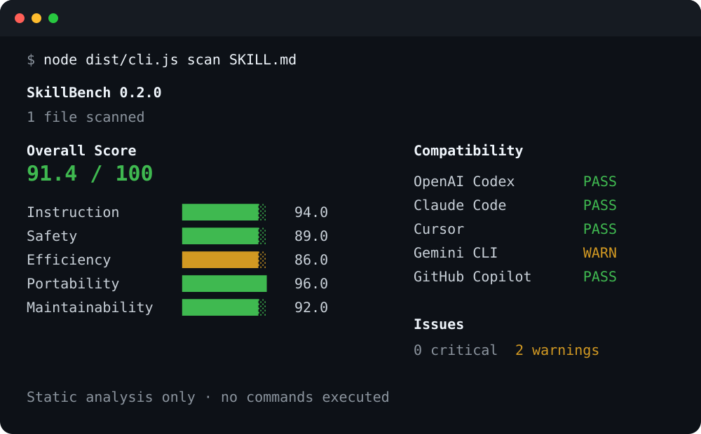

<p align="right">
  <strong>简体中文</strong> · <a href="README_EN.md">English</a>
</p>

<p align="center">
  
</p>

<h1 align="center">SkillBench</h1>

<p align="center"><strong>面向 AI Agent Skills 的开源基准、Linter 与跨 Agent 兼容性检查器。</strong></p>

<p align="center">
  <a href="https://github.com/EpochTX/skillbench/actions/workflows/ci.yml"></a>
  <a href="LICENSE"></a>
  
  
</p>



> npm 包 `skillbench-ai` 尚未正式发布。当前版本请从源码运行；正式发布后再使用 `npx skillbench-ai` 或全局安装命令。

## SkillBench 是什么？

Agent Skills、`AGENTS.md`、`CLAUDE.md`、Cursor Rules 等指令文件正在成为 AI 工程项目的一部分，但它们通常缺少传统代码已有的质量保障：静态检查、安全规则、回归对比、CI 门禁和机器可读报告。

SkillBench 为这类文件提供确定性的本地静态分析：

- **质量检查**：发现范围不清、表述模糊、重复内容、冲突指令和优先级滥用。
- **安全检查**：检测凭据访问、Prompt Injection、危险 Shell、任意代码执行、破坏性 Git/数据库操作等风险。
- **Token 效率分析**：估算 Token、重复 Token、潜在压缩空间和指令密度。
- **跨 Agent 兼容性**：分析同一套指令在 Codex、Claude Code、Cursor、Gemini CLI、GitHub Copilot 中的可用程度。
- **可解释评分**：每次扣分都有规则 ID、严重级别和依据，不依赖隐藏模型判断。
- **安全修复**：默认只预览；显式 `--write` 目前只执行可证明确定、幂等的低风险修复。
- **规则 Benchmark**：用人工标签语料量化 TP/FP/FN、Precision、Recall 与规则覆盖率，并作为发布门禁。
- **回归检测**：对比两个版本，区分新增、已解决和未变化的问题。
- **CI / SARIF**：支持 JSON、SARIF 2.1.0、GitHub Actions 原生注解和稳定退出码。

默认分析完全在本地完成，**不会执行被扫描文件中的脚本，也不会把源文本发送到网络服务**。

## 快速开始

### 从源码运行

```bash
git clone https://github.com/EpochTX/skillbench.git
cd skillbench

corepack enable
pnpm install --frozen-lockfile
pnpm build

node dist/cli.js scan SKILL.md
```

开发模式：

```bash
pnpm dev -- scan SKILL.md
```

npm 正式发布后，包名为 `skillbench-ai`，CLI 可执行文件名仍为 `skillbench`。

## 自动发现的文件

当目标是目录时，SkillBench 会自动发现常见 Agent 指令入口：

```text
SKILL.md
AGENTS.md
CLAUDE.md
GEMINI.md
.cursorrules
.cursor/rules/**/*.mdc
.github/copilot-instructions.md
.github/instructions/**/*.instructions.md
```

支持 Linux、macOS 和 Windows，要求 Node.js 20 或更高版本。

## CLI

| 命令                                  | 用途                                        |
| ------------------------------------- | ------------------------------------------- |
| `skillbench scan [target]`            | 完整分析：评分、问题、Token 与兼容性        |
| `skillbench score [target]`           | 仅输出总分与分类分数                        |
| `skillbench lint [target]`            | 输出全部规则命中、位置与修复建议            |
| `skillbench security [target]`        | 仅查看安全相关问题                          |
| `skillbench token [target]`           | Token、重复度与指令密度分析                 |
| `skillbench compat [target]`          | 五类 Agent 兼容性分析                       |
| `skillbench compare <before> <after>` | 对比两个版本的评分、Token、问题与兼容性变化 |
| `skillbench diff <before> <after>`    | `compare` 的别名                            |
| `skillbench rules [ruleId]`           | 列出全部规则，或查看某条规则详情            |
| `skillbench fix [target]`             | 默认只读预览安全修复与人工复核建议          |
| `skillbench fix [target] --write`     | 显式应用确定性的 SAFE 修复                  |
| `skillbench benchmark <manifest>`     | 运行人工标签的规则精度/覆盖率 Benchmark     |
| `skillbench init [directory]`         | 创建 `.skillbench.yml`                      |
| `skillbench badge [target]`           | 生成 shields.io Markdown Badge              |

### 输出格式

分析命令支持：

```text
terminal
json
sarif
github
```

`benchmark` 支持 `terminal` 与 `json`。

常用示例：

```bash
# JSON 报告
skillbench scan . --format json --output skillbench-report.json

# GitHub Actions 原生错误/警告注解
skillbench lint . --format github --ci --fail-on error

# SARIF 2.1.0
skillbench scan . --format sarif --output skillbench.sarif

# 回归检查：只让新增问题影响 CI
skillbench compare ./baseline ./candidate --ci --fail-on error

# 只预览，不写文件
skillbench fix .

# 显式写入，并在每个被修改文件旁创建不覆盖的备份
skillbench fix . --write --backup

# 人工标签规则语料门禁
skillbench benchmark tests/corpus/rules.yml --ci
```

稳定退出码：

| 退出码 | 含义                                  |
| -----: | ------------------------------------- |
|    `0` | 命令完成，未达到对应 CI 失败条件      |
|    `1` | 分析/对比阈值或 Benchmark 阈值被触发 |
|    `2` | 参数、配置、目标、解析或运行错误      |

分析与对比命令的 `--fail-on` 支持 `warning`、`error`、`critical`。

## 评分体系

默认总分由五个维度加权组成：

| 维度       | 权重 | 主要检查内容                                |
| ---------- | ---: | ------------------------------------------- |
| 指令质量   |  30% | 范围、清晰度、矛盾、模糊表达、优先级层次    |
| 安全性     |  25% | 破坏性操作、密钥、凭据、注入、任意执行      |
| Token 效率 |  15% | Token 估算、重复段落、重复指令、超大示例    |
| 可移植性   |  20% | Agent Skills 元数据、平台原生入口、厂商扩展 |
| 可维护性   |  10% | 文档结构、章节长度、段落密度与可导航性      |

严重级别提供基础扣分，每条规则再应用独立倍率。同一规则重复命中会采用递减扣分：`100% → 50% → 25%`，避免普通重复警告把总分异常拉低。

安全类 `critical` 问题会触发显式总分上限：

- 1～2 个 `critical`：总分最高 `59.9`
- 3 个及以上 `critical`：总分最高 `39.9`

所有扣分都会出现在 JSON 报告中，而不是隐藏在公式里。

```json
{
  "ruleId": "SB102",
  "severity": "error",
  "points": 8,
  "reason": "The agent is instructed to access a credential-bearing path."
}
```

## 规则体系

v0.2 推荐配置包含 **24 条确定性规则**：

| 范围            | 分类       | 关注点                                                         |
| --------------- | ---------- | -------------------------------------------------------------- |
| `SB001`–`SB007` | 指令质量   | 长度、重复、冲突、模糊语言、任务目的、优先级标记               |
| `SB100`–`SB106` | 安全性     | 危险命令、密钥、凭据目录、任意执行、注入、远程脚本、破坏性操作 |
| `SB200`–`SB203` | Token 效率 | 重复 Token、重复模态词、Markdown 噪声、大量代码示例            |
| `SB300`–`SB302` | 可维护性   | 缺少章节、超大章节、超大段落                                   |
| `SB400`–`SB402` | 可移植性   | Agent Skills 元数据、厂商专属字段、Cursor/Copilot 范围元数据   |

查看全部规则：

```bash
skillbench rules
```

查看单条规则：

```bash
skillbench rules SB102
```

规则可以在 `.skillbench.yml` 中单独关闭或覆盖严重级别。

## 规则 Benchmark

仓库维护一份**人工标签**的 case × rule 语料。标签不会从当前分析结果自动生成，因此规则改动如果产生新的误报或漏报，会直接显示为 FP/FN，而不是自动“更新快照”。

```bash
pnpm benchmark:rules
# 或
skillbench benchmark tests/corpus/rules.yml --ci
```

当前发布语料由 6 个完整真实 fixture 与确定性生成的阈值 fixture 组成，共 **17 个 case，覆盖 24/24 条内置规则**；CI 门槛固定为：

- Precision：`100%`
- Recall：`100%`
- Rule coverage：`100%`
- 当前基线：`TP 24 · FP 0 · FN 0`

Benchmark 使用推荐默认配置运行，不继承开发者目录中的 `.skillbench.yml`，机器报告只保留可复现的 manifest 相对路径。

## 安全自动修复

`skillbench fix` **默认永远只读**。只有显式指定 `--write` 才会修改文件；当前自动 writer 故意只支持 `SB003` 的**完全相同纯文本段落**删除。近似重复、列表、表格、代码块、结构化 Markdown 与安全类 remediation 仍然只给人工复核建议。

写入路径包含额外保护：

- plan 保存源文件 SHA-256，并在写入前再次校验，拒绝 stale plan；
- 目标变成符号链接或非普通文件时拒绝写入；
- 替换内容先写入同目录临时文件，再以 rename-based replacement 提交；
- `--backup` 会预检全部 `.skillbench.bak` 目标，绝不覆盖已有备份；
- 保留 CRLF/LF 与相关权限位；
- 多文件中途失败会尝试回滚已提交文件，回滚不完整时保留恢复材料。

这是**逐文件原子替换 + 多文件 best-effort rollback**，并不声称提供跨文件系统事务。

## Token 分析

v0.2 使用本地、语言感知的 Token 估算。拉丁字母/数字、CJK 字符与标点采用不同近似系数；它是工程估算值，并不冒充某个特定模型的官方 tokenizer。

```text
Estimated Tokens           2,841
Duplicate Tokens             318
Potential Reduction         11.2%
Instruction Density         46.8%
```

重复 Token 基于后续完全相同或高度相似的段落计算，同时报告潜在压缩比例。

## Agent 兼容性

SkillBench 将平台相关逻辑隔离在 Adapter 层，不把不同 Agent 的条件分支散落进规则引擎。

| Agent          | 可移植 Skill | 原生指令入口                                                     |
| -------------- | ------------ | ---------------------------------------------------------------- |
| OpenAI Codex   | `SKILL.md`   | `AGENTS.md`                                                      |
| Claude Code    | `SKILL.md`   | `CLAUDE.md`                                                      |
| Cursor         | `SKILL.md`   | `AGENTS.md`、`.cursor/rules/*.mdc`；`.cursorrules` 标记为 legacy |
| Gemini CLI     | `SKILL.md`   | `GEMINI.md`                                                      |
| GitHub Copilot | `SKILL.md`   | `.github/copilot-instructions.md`、作用域 `.instructions.md`     |

兼容性状态：

- `SUPPORTED`：存在文档化的原生或开放标准路径。
- `PARTIAL`：可用，但存在已知限制。
- `UNSUPPORTED`：当前文件名或元数据不是该平台的原生入口。
- `UNKNOWN`：SkillBench 无法可靠判断。

## 回归对比

`compare` / `diff` 会用同一套配置分析两个目标，并输出：

- 总分与分类分数变化
- Token 与文件数量变化
- 新增问题
- 已解决问题
- 未变化问题
- Agent 兼容性变化

```bash
skillbench compare ./baseline ./candidate
skillbench diff ./baseline ./candidate --format json
skillbench compare ./baseline ./candidate --ci --fail-on error
```

在 CI 模式下，只有**新增问题**参与失败阈值判断，因此历史技术债不会阻塞无关改进。

## SARIF 与 GitHub Actions annotations

SARIF 输出遵循 SARIF 2.1.0，可用于 GitHub Code Scanning 及其他 SARIF 消费端。报告包含规则元数据、源码位置、稳定指纹、严重级别、分类和修复建议。

```bash
skillbench scan . --format sarif --output skillbench.sarif
```

轻量级 GitHub Actions 集成可以使用 `github` 格式，直接输出原生 `::error`、`::warning` 和 `::notice`：

```bash
skillbench lint . --format github --ci --fail-on error
```

## CI 使用方式

npm 包正式发布前，可以直接从源码在 CI 中运行。下面的示例把工具检出到工作区之外，并固定到已验证的 v0.2.0 源码快照，避免把 SkillBench 自身文件混入扫描目标，也避免后续 `main` 变化影响既有 CI：

```yaml
name: SkillBench

on:
  pull_request:
  push:
    branches: [main]

permissions:
  contents: read

jobs:
  skillbench:
    runs-on: ubuntu-latest
    steps:
      - uses: actions/checkout@d23441a48e516b6c34aea4fa41551a30e30af803 # v6
        with:
          persist-credentials: false
      - uses: pnpm/action-setup@0977fd99725f1db4007ccb2928dbb4e90d06cc86 # v6
        with:
          version: 10.34.5
      - uses: actions/setup-node@249970729cb0ef3589644e2896645e5dc5ba9c38 # v6
        with:
          node-version: 20
      - name: Install SkillBench v0.2.0 from source
        run: |
          git clone --no-checkout https://github.com/EpochTX/skillbench.git "$RUNNER_TEMP/skillbench"
          git -C "$RUNNER_TEMP/skillbench" checkout --detach 35e2415a612f838bd08bcb3f6c536e92be60d221
          pnpm --dir "$RUNNER_TEMP/skillbench" install --frozen-lockfile
          pnpm --dir "$RUNNER_TEMP/skillbench" build
      - name: Check agent instructions
        run: node "$RUNNER_TEMP/skillbench/dist/cli.js" scan "$GITHUB_WORKSPACE" --ci --fail-on critical
```

仓库自身的 `.github/workflows/ci.yml` 会在 Ubuntu 上验证 Node.js 20 和 22，并在 macOS、Windows 上执行跨平台测试、构建与 production CLI Benchmark。

## 配置文件

初始化：

```bash
skillbench init
```

示例 `.skillbench.yml`：

```yaml
extends: recommended

rules:
  SB002: off
  SB100: warning

score:
  instruction: 30
  safety: 25
  efficiency: 15
  portability: 20
  maintainability: 10

ignore:
  - examples/**
  - vendor/**
```

权重可以使用任意非负比例，计算总分时会自动归一化。未知字段、未知规则 ID 和非法严重级别会直接报配置错误，不会被静默忽略。

## JSON 报告与 schema

JSON 是稳定的机器集成格式。v0.2.0 当前报告 schema 版本为 `0.1`：

```json
{
  "schemaVersion": "0.1",
  "tool": { "name": "skillbench", "version": "0.2.0" },
  "target": "/repo/SKILL.md",
  "score": { "overall": 91.4, "categories": {} },
  "summary": { "info": 0, "warning": 2, "error": 0, "critical": 0 },
  "issues": [],
  "compatibility": {},
  "tokens": {},
  "files": []
}
```

Reporter 层与分析核心解耦，因此可以扩展新的输出格式，而不需要修改规则或评分逻辑。

## 安全模型

SkillBench 默认采用保守的静态分析边界：

- 不执行被扫描文件中的 Shell、Python、JavaScript、Hook 或脚本。
- 输入按不可信 UTF-8 文本处理，单个指令文件上限为 2 MiB。
- 目录扫描不跟随符号链接。
- 命中的密钥或凭据证据在输出前统一脱敏。
- 防御性示例与直接执行指令会在可确定的上下文中使用不同严重级别。
- 默认不会把源文本发送到任何网络服务。
- 自动修复默认只预览；写入必须显式 `--write`，且当前 writer 范围故意保持极窄。

安全问题请按照 [SECURITY.md](SECURITY.md) 中的流程私下报告，请勿提交真实凭据。

## 架构

| 模块         | 职责                                                 | 扩展方向          |
| ------------ | ---------------------------------------------------- | ----------------- |
| `parser/`    | Frontmatter、段落、章节与源码位置解析                | 新文本格式        |
| `rules/`     | 按分类组织的确定性规则                               | 新规则            |
| `core/`      | 分析、Token、评分、对比、安全修复与 Benchmark 编排   | 新分析器/评分配置 |
| `adapters/`  | Agent 原生入口检测与兼容性推理                       | 新 Agent          |
| `reporters/` | Terminal、JSON、SARIF、GitHub 注解、Badge、Benchmark | 新报告格式        |
| `cli/`       | 命令、参数、CI 策略与用户错误                        | 新工作流          |

公共 TypeScript API 从包根入口导出；稳定范围与兼容策略见 [docs/API.md](docs/API.md)。

## 项目结构

```text
skillbench/
├── src/
│   ├── adapters/
│   ├── cli/
│   ├── core/
│   ├── parser/
│   ├── reporters/
│   └── rules/
├── tests/
│   ├── corpus/
│   └── fixtures/
├── examples/
├── docs/
├── assets/
├── .github/
└── .skillbench.yml
```

## 开发方式

```bash
corepack enable
pnpm install --frozen-lockfile

pnpm lint
pnpm typecheck
pnpm test
pnpm benchmark:rules
pnpm build
```

完整发布前门禁：

```bash
pnpm release:check
```

技术栈：TypeScript、Commander、Zod、YAML、Vitest、ESLint、Prettier、tsup。

## Roadmap

- **v0.1**：静态分析、安全规则、Token 分析、五 Agent 兼容性、CLI、JSON、CI、Badge。
- **v0.2**：SARIF 2.1.0、GitHub Actions 注解、`compare` / `diff`、规则查询、报告文件输出。
- **1.0 hardening（进行中）**：确定性 safe-fix writer、事务式写入保护、24/24 人工标签规则 Benchmark、公共 API 契约、性能基线、依赖安全门禁、npm trusted publishing 与最终发布验证。
- **1.x**：在兼容承诺内继续增加确定性规则、Agent Adapter、可证明安全的 fixer 与分析能力。
- **未来探索**：显式沙箱中的执行型 Skill Benchmark、可选 LLM Judge、Registry/公开排行榜；这些不会作为 1.0 稳定性承诺的前置噱头。

1.0 的可验收发布条件见 [docs/1.0-RELEASE-CRITERIA.md](docs/1.0-RELEASE-CRITERIA.md)。版本号不会在条件未满足时提前改成 `1.0.0`。

## Contributing

欢迎提交新规则、新 Agent Adapter、测试、文档和兼容性改进。请先阅读 [CONTRIBUTING.md](CONTRIBUTING.md)。提交前确保：

```bash
pnpm lint
pnpm typecheck
pnpm test
pnpm benchmark:rules
pnpm build
```

## License

[MIT](LICENSE) © SkillBench contributors.